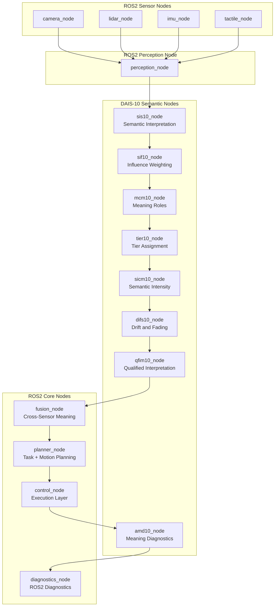

```mermaid
flowchart TD

    %% -------------------------
    %% SENSOR + PERCEPTION LAYER
    %% -------------------------

    subgraph Sensors["ROS2 Sensor Nodes"]
        CAM["camera_node"]
        LIDAR["lidar_node"]
        IMU["imu_node"]
        TACT["tactile_node"]
    end

    subgraph Perception["ROS2 Perception Node"]
        PER["perception_node"]
    end

    %% -------------------------
    %% DAIS-10 SEMANTIC LAYER
    %% -------------------------

    subgraph DAIS10_Semantic["DAIS‑10 Semantic Nodes"]
        SIS10["sis10_node\nSemantic Interpretation"]
        SIF10["sif10_node\nInfluence Weighting"]
        MCM10["mcm10_node\nMeaning Roles"]
        TIER10["tier10_node\nTier Assignment"]
        SICM10["sicm10_node\nSemantic Intensity"]
        DIFS10["difs10_node\nDrift and Fading"]
        QFIM10["qfim10_node\nQualified Interpretation"]
        AMD10["amd10_node\nMeaning Diagnostics"]
    end

    %% -------------------------
    %% ROS2 CORE EXECUTION LAYER
    %% -------------------------

    subgraph ROS2_Core["ROS2 Core Nodes"]
        FUSION["fusion_node\nCross‑Sensor Meaning"]
        PLANNER["planner_node\nTask + Motion Planning"]
        CONTROL["control_node\nExecution Layer"]
        DIAG["diagnostics_node\nROS2 Diagnostics"]
    end

    %% -------------------------
    %% CONNECTIONS
    %% -------------------------

    CAM --> PER
    LIDAR --> PER
    IMU --> PER
    TACT --> PER

    PER --> SIS10
    SIS10 --> SIF10
    SIF10 --> MCM10
    MCM10 --> TIER10
    TIER10 --> SICM10
    SICM10 --> DIFS10
    DIFS10 --> QFIM10

    QFIM10 --> FUSION
    FUSION --> PLANNER
    PLANNER --> CONTROL

    CONTROL --> AMD10
    AMD10 --> DIAG
```
