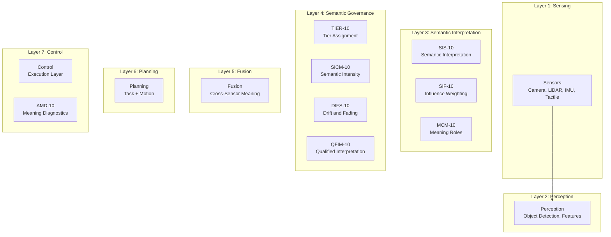

```mermaid
flowchart TD

    subgraph Layer1_Sensing["Layer 1: Sensing"]
        SENSORS["Sensors\nCamera, LiDAR, IMU, Tactile"]
    end

    subgraph Layer2_Perception["Layer 2: Perception"]
        PERCEPTION["Perception\nObject Detection, Features"]
    end

    subgraph Layer3_Semantic_Interpretation["Layer 3: Semantic Interpretation"]
        SIS10["SIS‑10\nSemantic Interpretation"]
        SIF10["SIF‑10\nInfluence Weighting"]
        MCM10["MCM‑10\nMeaning Roles"]
    end

    subgraph Layer4_Semantic_Governance["Layer 4: Semantic Governance"]
        TIER10["TIER‑10\nTier Assignment"]
        SICM10["SICM‑10\nSemantic Intensity"]
        DIFS10["DIFS‑10\nDrift and Fading"]
        QFIM10["QFIM‑10\nQualified Interpretation"]
    end

    subgraph Layer5_Fusion["Layer 5: Fusion"]
        FUSION["Fusion\nCross‑Sensor Meaning"]
    end

    subgraph Layer6_Planning["Layer 6: Planning"]
        PLANNING["Planning\nTask + Motion"]
    end

    subgraph Layer7_Control["Layer 7: Control"]
        CONTROL["Control\nExecution Layer"]
        AMD10["AMD‑10\nMeaning Diagnostics"]
    end

    SENSORS --> PERCEPTION
```
    PERCEPTION --> SIS10
    SIS10 --> SIF10 --> MCM10 --> TIER10 --> SICM10 --> DIFS10 --> QFIM10 --> FUSION --> PLANNING --> CONTROL --> AMD10
