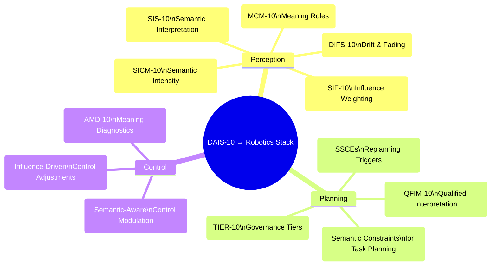
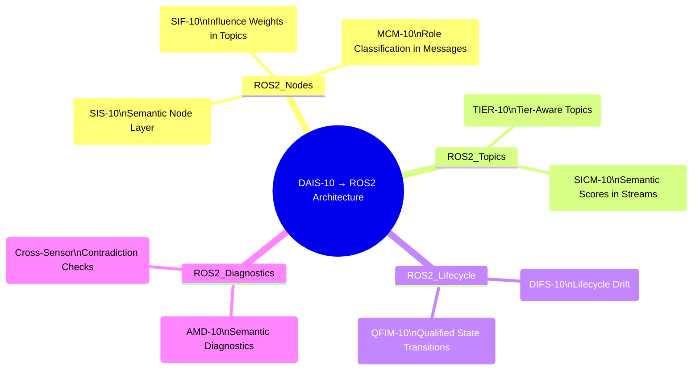
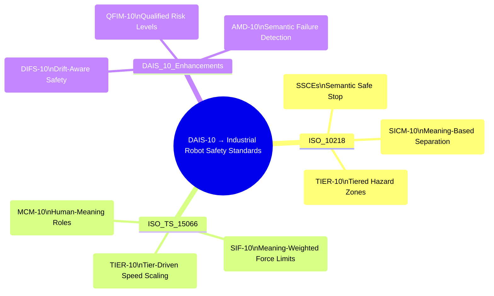
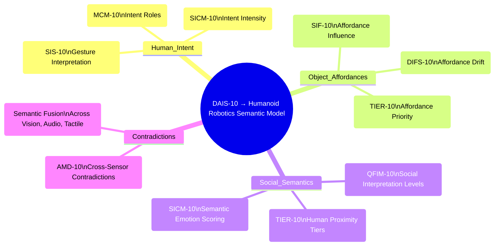

1. DAIS‑10 → Robotics Stack (Perception → Planning → Control)

2. DAIS‑10 → ROS2 Architecture

3. DAIS‑10 → Industrial Robot Safety Standards (ISO 10218, ISO/TS 15066)

4. DAIS‑10 → Humanoid Robotics Semantic Model

